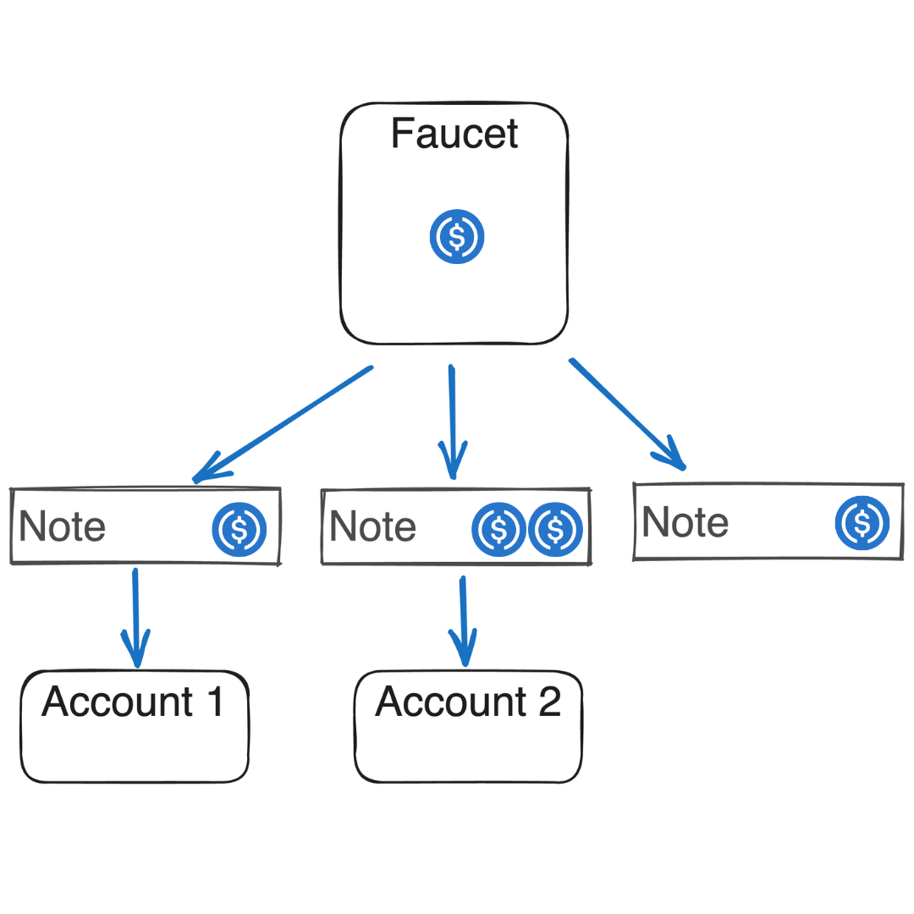
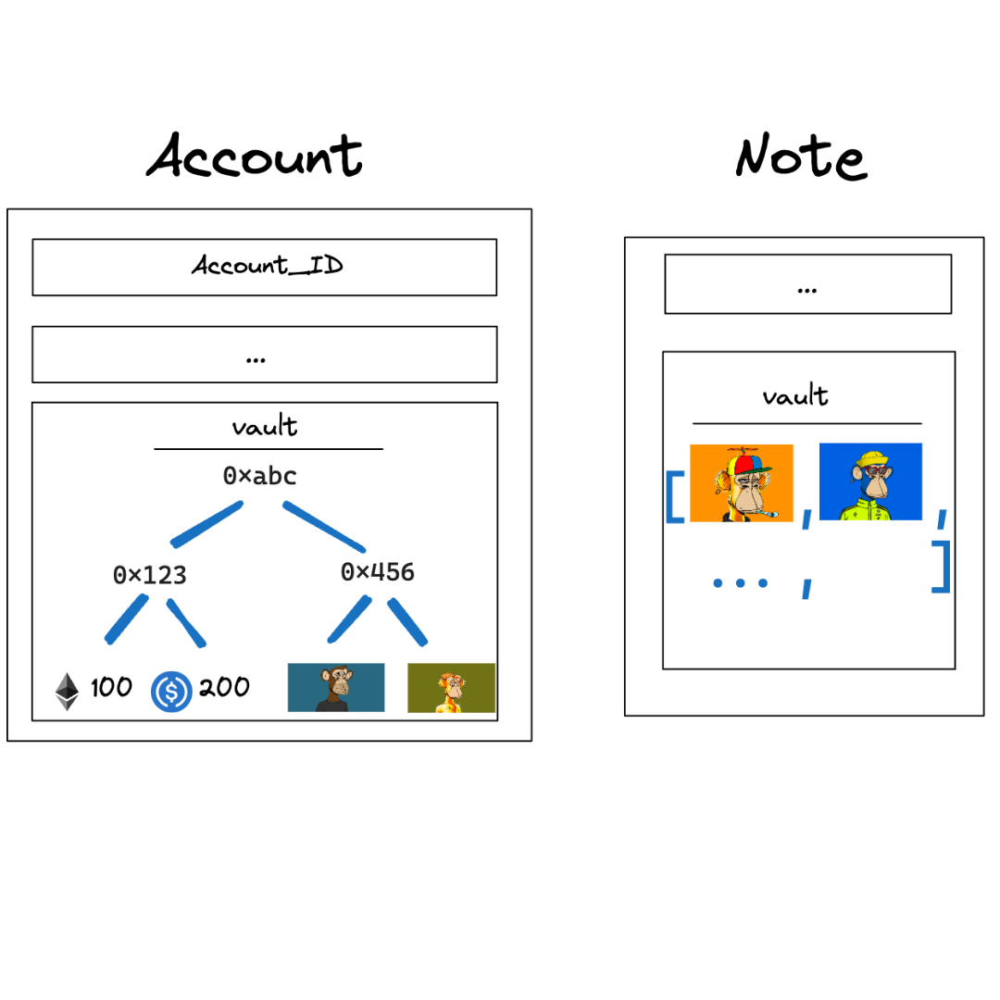

# Asset

> Fungible and Non-fungible assets in the Miden protocol.

## What is the purpose of an asset?

In Miden, `Asset`s serve as the primary means of expressing and transferring value between [accounts](accounts.md) through [notes](notes.md). They are designed with four key principles in mind:

1. **Parallelizable exchange:**  
    By managing ownership and transfers directly at the account level instead of relying on global structures like ERC20 contracts, accounts can exchange `Asset`s concurrently, boosting scalability and efficiency.

2. **Self-sovereign ownership:**  
   `Asset`s are stored in the accounts directly. This ensures that users retain complete control over their `Asset`s.

3. **Censorship resistance:**  
   Users can transact freely and privately with no single contract or entity controlling `Asset` transfers. This reduces the risk of censored transactions, resulting in a more open and resilient system.

4. **Flexible fee payment:**  
   Unlike protocols that require a specific base `Asset` for fees, Miden allows users to pay fees in any supported `Asset`. This flexibility simplifies the user experience.

## What is an asset?

An `Asset` in Miden is a unit of value that can be transferred from one [account](accounts.md) to another using [notes](notes.md).

## Native asset

> All data structures following the Miden asset model that can be exchanged.

Native `Asset`s adhere to the Miden `Asset` model (encoding, issuance, storage). Every native `Asset` is encoded using 32 bytes, including both the [ID](accounts.md#id) of the issuing account and the `Asset` details.

### Issuance

> **Info**
> - Only [faucet](accounts.md#account-type) accounts can issue assets.

Faucets can issue either fungible or non-fungible `Asset`s as defined at account creation. The faucet's code specifies the `Asset` minting conditions: i.e., how, when, and by whom these `Asset`s can be minted. Once minted, they can be transferred to other accounts using notes.

### Type

#### Fungible asset

Fungible `Asset`s are encoded with the amount and the `faucet_id` of the issuing faucet. The amount is always 2^{63} - 1 or smaller, representing the maximum supply for any fungible `Asset`. Examples include ETH and various stablecoins (e.g., DAI, USDT, USDC).

#### Non-fungible asset

Non-fungible `Asset`s are encoded by hashing the `Asset` data into 32 bytes and placing the `faucet_id` as the second element. Examples include NFTs like a DevCon ticket.

### Storage

[Accounts](accounts.md) and [notes](notes.md) have vaults used to store `Asset`s. Accounts use a sparse Merkle tree as a vault while notes use a simple list. This enables an account to store a practically unlimited number of assets while a note can only store 255 assets.

### Burning

`Asset`s in Miden can be burned through various methods, such as rendering them unspendable by storing them in an unconsumable note, or sending them back to their original faucet for burning using it's dedicated function.

## Alternative asset models

> All data structures not following the Miden asset model that can be exchanged.

Miden is flexible enough to support other `Asset` models. For example, developers can replicate Ethereum’s ERC20 pattern, where fungible `Asset` ownership is recorded in a single account. To transact, users send a note to that account, triggering updates in the global hashmap state.

## Conclusion

Miden’s `Asset` model provides a secure, flexible, scalable, and privacy-preserving framework for representing and transferring value. By embedding `Asset` information directly into accounts and supporting multiple `Asset` types, Miden fosters a decentralized ecosystem where users maintain their privacy, control, transactions can scale efficiently, and censorship is minimized.
