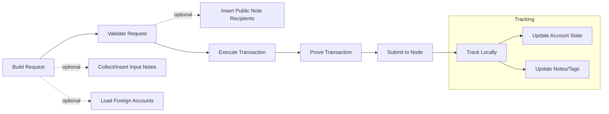

## Troubleshooting and transaction lifecycle (CLI)

This guide helps you troubleshoot common issues and understand the end-to-end lifecycle of transactions and notes in the Miden client.

### TL;DR checklist

> Note: This section applies to the Miden CLI client. Guidance for the Rust and Web clients may differ.

- Ensure you have a proper configuration setup: either a global config at `~/.miden/miden-client.toml` or a local config at `./.miden/miden-client.toml`. Local config takes priority if both exist.
- If you need a clean local state, delete the SQLite store file referenced by `store_filepath` (default: `.miden/store.sqlite3`). It will be recreated automatically on the next command.
- Verify your node RPC endpoint is reachable and correct in your configuration file (local `.miden/miden-client.toml` or global `~/.miden/miden-client.toml`).
- Run with debug output when troubleshooting: add `--debug` or set `MIDEN_DEBUG=true`.
- Run `miden-client sync` to refresh local state after errors involving missing data or outdated heights.

### Enable debug output

- CLI flag: `miden-client --debug <command> ...` (overrides `MIDEN_DEBUG`)
- Environment variable: `MIDEN_DEBUG=true`

When enabled, the transaction executor and script compiler emit debug logs that help diagnose MASM-level issues (you can also consult the Miden VM debugging instructions).

### Typical CLI outputs when debugging

```sh
# Enable debug output for a command
miden-client --debug send --sender <SENDER> --target <TARGET> --asset 100::<FAUCET_ID>

# Force non-interactive submission (e.g., CI)
miden-client send --force ...

# Refresh local state
miden-client sync
```

If you see a gRPC error, it may include a status-derived kind (e.g. `Unavailable`, `InvalidArgument`) which narrows possible causes.

### Common errors and how to resolve

Below are representative errors you may encounter, their likely causes, and suggested fixes.

#### `RpcError.GrpcError: Unavailable` / `DeadlineExceeded`
- Cause: Node is down, unreachable, or behind a load balancer that blocked the request.
- Fix: Check `rpc.endpoint` in your configuration file (local `.miden/miden-client.toml` or global `~/.miden/miden-client.toml`), verify the node is running/accessible, and retry.

#### `RpcError.InvalidArgument` / `ExpectedDataMissing` / `InvalidResponse`
- Cause: Malformed request parameters or unexpected server response.
- Fix: Re-check command flags/inputs. If using partial IDs, ensure they map to a single entity. Update to the latest client if the server API has changed.

#### Client/network compatibility mismatch
- Cause: Client and network versions or the genesis header commitment are incompatible.
- Symptoms: CLI may report messages like:

  ```
  accept header validation failed: server rejected request - please check your version and network settings
  ```

  or requests being rejected due to a mismatched genesis header commitment.
- Details: These are validated by the node by verifying client headers on gRPC requests.
- Fix: Ensure your client version matches the target network. Switch to the correct network or upgrade/downgrade the client accordingly. Verify the configured genesis header commitment matches the network, then retry.

#### `ClientError.AccountDataNotFound(<account_id>)`
- Cause: The account is not known to the local store yet.
- Fix: Create/import the account first, or run `miden-client sync` to fetch it if it exists on-chain.

#### `ClientError.AccountLocked(<account_id>)`
- Cause: Attempting to modify a locked account.
- Fix: Unlock or use another account as appropriate.

#### `ClientError.StoreError(AccountCommitmentAlreadyExists(...))`
- Cause: Trying to apply a transaction whose final account commitment is already present locally.
- Fix: Ensure you are not re-applying the same transaction. Sync and check transaction status.

#### `ClientError.NoteNotFoundOnChain(<note_id>)` / `RpcError.NoteNotFound(<note_id>)`
- Cause: The note has not been published/committed yet or the ID is incorrect.
- Fix: Verify the note ID. If it should exist, run `miden-client sync` and retry.

#### `ClientError.TransactionInputError` / `TransactionScriptError`
- Cause: Invalid transaction inputs, script logic errors, or failing constraints.
- Fix: Run with `--debug` to collect execution logs. Validate input notes, foreign accounts, and script assumptions.

#### `ClientError.TransactionProvingError`
- Cause: Local proving failed or remote prover returned an error.
- Fix: If using remote proving, verify `remote_prover_endpoint` is reachable and add `--delegate-proving`. Check prover logs.

#### Recency/block delta errors
- Cause: Client is too far behind the network and validation enforces a max delta.
- Fix: Run `miden-client sync` or increase `max_block_number_delta` via `miden-client init --block-delta <N>` and re-run.

### Transaction lifecycle (CLI-oriented overview)

For the full protocol-level lifecycle, see the Miden book: [Transaction lifecycle](https://0xmiden.github.io/miden-docs/imported/miden-base/src/transaction.html#transaction-lifecycle).



Key states the CLI surfaces:

- Transaction status: `Pending` (after execution), `Committed` (after node inclusion), `Discarded` (not included).
- Input notes: `Expected` → `Processing` → `Consumed` (after sync) or `Committed` if fetched with inclusion.

### Configuration troubleshooting

#### Config priority confusion
- **Issue**: Unclear which configuration is being used (local vs global)
- **Check**: Run commands from different directories to see if behavior changes
- **Local priority**: If `./.miden/miden-client.toml` exists, it overrides `~/.miden/miden-client.toml`
- **Fix**: Use `miden-client clear-config` to remove unwanted configurations, or `miden-client clear-config --global` to remove only global config. Note: Running `miden-client clear-config` without flags follows priority: if a local .miden folder exists, it removes only that one; if no local folder exists, it removes the global one. Use `--global` to specifically target the global configuration regardless of local config presence.

#### Clean configuration reset
- **Complete reset**: Use `miden-client clear-config` to remove the active configuration (follows priority: local first, then global)
- **Selective reset**: Use `miden-client clear-config --global` to remove only global configuration while preserving local
- **Fresh start**: After clearing, run `miden-client init` (global) or `miden-client init --local` (local) to recreate

### Recovery flow

1. Re-run with `--debug` or `MIDEN_DEBUG=true` for richer logs.
2. Verify `rpc.endpoint` connectivity and timeouts.
3. Run `miden-client sync` to refresh local headers/notes.
4. If local DB is inconsistent for development purposes, delete the store file (`.miden/store.sqlite3` in local config or `~/.miden/store.sqlite3` in global config) and retry.
5. For configuration issues, use `miden-client clear-config` to reset config and `miden-client init` to recreate.
6. Adjust `max_block_number_delta` if strict recency checks block validation.
7. If proving errors persist with a remote prover, confirm `remote_prover_endpoint` and consider running locally to isolate the issue.

### References

- CLI debug flag and environment variable are documented in `CLI` and `Config` docs.
- Common error enums originate from the client and RPC layers.
- Protocol lifecycle: [Miden book — Transaction lifecycle](https://0xmiden.github.io/miden-docs/imported/miden-base/src/transaction.html#transaction-lifecycle)
