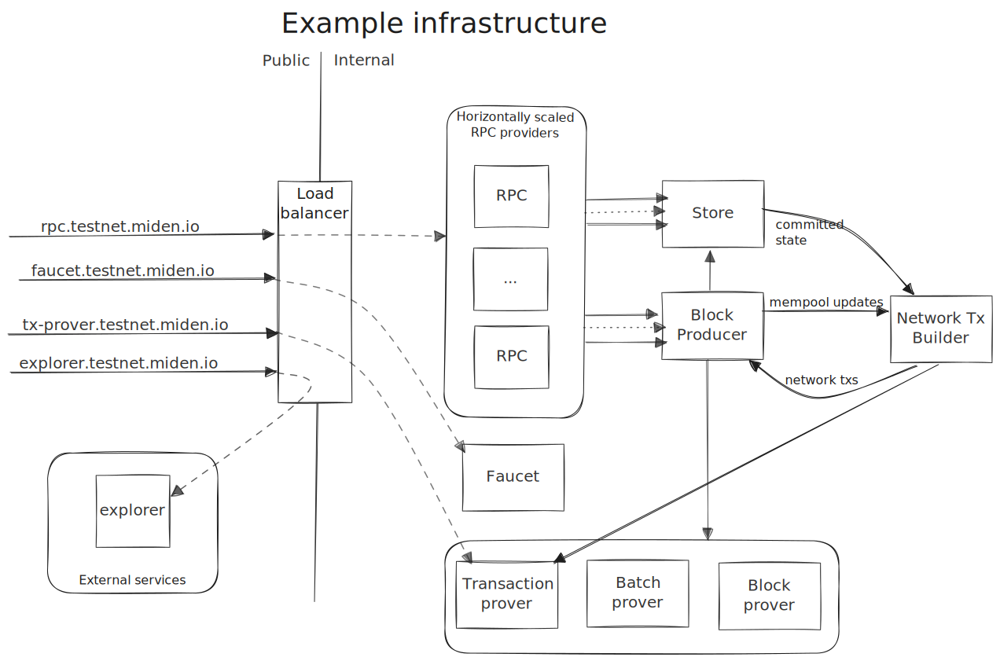

# Node architecture

The node itself consists of four distributed components: store, block-producer, network transaction builder, and RPC.

The components can be run on separate instances when optimised for performance, but can also be run as a single process
for convenience. The exception to this is the network transaction builder which can currently only be run as part of
the single process. At the moment both of Miden's public networks (testnet and devnet) are operating in single process
mode.

The inter-component communication is done using a gRPC API which is assumed trusted. In other words this _must not_ be
public. External communication is handled by the RPC component with a separate external-only gRPC API.

## RPC

The RPC component provides a public gRPC API with which users can submit transactions and query chain state. Queries are
validated and then proxied to the store. Similarly, transaction proofs are verified before submitting them to the
block-producer. This takes a non-trivial amount of load off the block-producer.

This is the _only_ external facing component and it essentially acts as a shielding proxy that prevents bad requests
from impacting block production.

It can be trivially scaled horizontally e.g. with a load-balancer in front as shown above.

## Store

The store is responsible for persisting the chain state. It is effectively a database which holds the current state of
the chain, wrapped in a gRPC interface which allows querying this state and submitting new blocks.

It expects that this gRPC interface is _only_ accessible internally i.e. there is an implicit assumption of trust.

## Block-producer

The block-producer is responsible for aggregating received transactions into blocks and submitting them to the store.

Transactions are placed in a mempool and are periodically sampled to form batches of transactions. These batches are
proved, and then periodically aggregated into a block. This block is then proved and committed to the store.

Proof generation in production is typically outsourced to a remote machine with appropriate resources. For convenience,
it is also possible to perform proving in-process. This is useful when running a local node for test purposes.

## Network transaction builder

The network transaction builder monitors the mempool for network notes, and creates transactions consuming these.
We call these network transactions and at present this is the only entity that is allowed to create such transactions.
This restriction is will be lifted in the future, but for now this component _must_ be enabled to have support for
network transactions.

The mempool is monitored via a gRPC event stream served by the block-producer.
