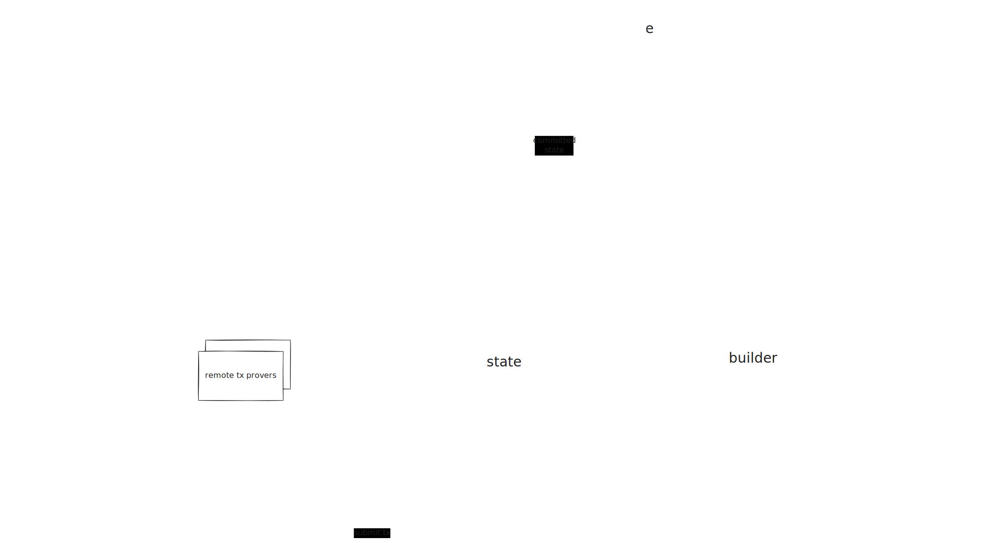

# Node components

The node is split into three distinct components that communicate via gRPC. See the
[Operator guide#architecture](../operator/architecture.md) chapter for an overview of each component.

The following sections will describe the inner architecture of each component.

